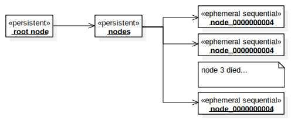

# The architectural approach <span style="float:right"><span>

## Terminology

* In this document whenever the term *node* is used, the meaning is a Monastery node.
* Similarly, the term *znode* is reserved to describe Zookeeper znodes

## Root znode

There can be multiple Monastery based clusters using the same Zookeeper cluster as
the core implementation. To keep them separate from each other, each Monastery cluster
holds all of its coordination information under a single root znode. The implementation
provides a default name for the root znode, making it easy to use the simple use case,
where only one Monastery cluster is used by an application. The node builder, as well as
the node factory builder allows to override the default root znode path.

The root znode is persistent, and is created by the first node that uses the
zookeeper cluster. Once created the znode itself is not modified.

In further discussion we will refer to the root znode path as ```/monastery/root```,
remembering that it can be arbitrary.

## Node announcement, registration and discovery

Under the root znode, a child persistent znode named ```nodes``` is created by the first node that is announce to the Monastery cluster. This node serves as the parent to all the
announced nodes in the cluster.

Each announced node creates an *ephemeral sequential* znode under ```/monastery/root/nodes```, and this znode's name becomes the node ID. Should the node
die, or lose the connection with the zookeeper cluster then the ephemeral znode will
disappear and the node will enter a permanent disconnected state.



### Node supervisor

To avoid too many complications the Monastery implementation does not use the Curator
persistent ephemeral node recipe. This recipe hides the essential complexity of 
Zookeeper too much. Instead, it is advised that users use a node supervisor instead of
using the node implementation directly. The node supervisor tracks the health state of
the node and its connection to Zookeeper. Should a node be disconnected, the supervisor
can notify the application, which can then create a new node and announce it. The node
supervisor can also automate this process and attempt to replace disconnected nodes
automatically.

This approach not only exposes what is really going on to the application, but it also makes monitoring the overall health and connectivity. This allows the application to
support better resilience and to be responsive to failure.

## Shared data approach

Shared data in the Zookeeper implementation relies on some of the Curator recipes as well as some basic functionality of Zookeeper. The basic idea is that scalars can be represented by single znodes and that collections can be represented by small trees: a znode that represents the collection, and children representing the values in the collection. Whenever dealing with a collection a Curator tree cache allows for handy replication to individual Monastery nodes.

Note that this pattern gives us at best eventual consistency of collections. Luckily, much can be done for cluster control and coordination with eventually consistent collections.

It is important to note that the Zookeeper Monastery implementation offers several supported forms of sharing data via Zookeeper. However, users are not restricted to use only those. The Monastery implementation uses (under ```/monastery/root```) the following znodes:
* ```nodes```
* ```data```

Those two should be assumed to be managed by the Monastery implementation. Capabilities or extensions of the Monastery implementation should be free to use other znodes under ```monastery/root``` at their own risk. The implementation does not provide any support for governing or coordinating the use of Zookeeper outside the documented areas.

### Persistent shared data

Generally specific, data that is not node-specific is stored in persistent znodes. Examples of such data include service configuration, global policies for some compound capabilities, etc.

### Ephemeral data

Any data that is node-specific is stored in ephemeral znodes. Note that the term "node-specific" here really applies to the node that contributes the data, not necessarily the node that the data is about.

Suppose, for instance that some capability allows nodes to make claims or observations about other nodes, maybe to gossip about their availability. The node *making the claims* should be the node that creates and owns the collection. This way, if the node dies or disconnects then only the information *it* contributed goes away. The node that is the *subject* of the claim should really have nothing to do with this collection.

In some cases, the collection itself is not ephemeral, but the data in it is. This is exactly the case in the implementation of node registration. ```/monastery/root/nodes``` is a persistent znode. The children znodes under it are ephemeral and are created and touched only by each registered node. To all other nodes, these znodes are read-only.

### Data addressing

The shared data capability in the Zookeeper implementation implements the ```SharedData```
capability of Monastery. The Capability provides an interface for data addressing, which
includes Teh type of data, the name of the shared variable and the scope of this variable.
In this implementation, this gets translated into a (normalized) JSON string that becomes the address of the actual data. Each piece of data, scalar or collection, ends up having 
a znode under which all the data resides. The exact path of this znode is determined by
the implementation. Several factors are considered for constructing the path:
* The scope and name together can be expressed as a single JSON value, which is then hashed. This hash is the last path element.
* The data type may add another path element.
* Finally, the implementation decides whether the znode is persistent or not, and whether the child nodes are persistent or not based on the lifespan hints provided by the interface.

The important things is that given a Monastery data address, the implementation can produce a specific and consistent Zookeeper path for each shared cluster variable and for each individual member of any collection.

To ensure that the names used do not create problems with znode naming restrictions, the znode names themselves are always hash values and not the actual names used. This isolates capability implementations from the particulars of zookeeper. However, it makes it hard to use zookeeper tools to browse the data. So the implementation also includes a data browsing capability.

### Representation of scalars

Given an address, then a scalar representation becomes simple. The data for the znode is a JSON structure with two elements. For example:
```JSON
{
  "type" : "Integer",
  "value" : "3"
}
```

### Representation of collections

Collections are a bit more complicated, and the representation is geared specifically for Zookeeper.

#### Sets

For a set, the implementation hashes the value of each element. This hashed value become a name of a child node. Given the set's address path ```/monastery/root/data/215093cfae6bc7965544f1f1776e728c3a39d0bf841baabbfecd8a137c02d23d``` and a value of "my element value", then the implementation will create a child znode with the path ```/monastery/root/data/215093cfae6bc7965544f1f1776e728c3a39d0bf841baabbfecd8a137c02d23d/189fb5f1dac9ba3069955431b129191c96e4f8c7dec6bcb2101f641a833afbf5```. This znode's data will be the actual value of the node, encoded like a scalar.

#### Lists

Lists are simpler. Each child znode of the list's address has a name which is the ordinal of the list element and data encoded like a scalar.

* ```/monastery/root/data/215093cfae6bc7965544f1f1776e728c3a39d0bf841baabbfecd8a137c02d23d/0```
* ```/monastery/root/data/215093cfae6bc7965544f1f1776e728c3a39d0bf841baabbfecd8a137c02d23d/1```
* etc.


#### Maps

Maps are encoded similarly to sets. The only difference is that the child znode's names are constructed by hashing the key of the maps and the data is then a key/value pair, where the value and the key are both encoded like scalars. So given a map element with a string key and and integer value:
* key: "Virginia"
* value: 10

Then the znode name will be ```hash("Virginia")```. And the znode's data will be:
```JSON
{
  "key" :  {
    "type" : "String",
    "value" : "Virginia"
  },
  "value" : {
    "type" : "Integer",
    "value" : "10"
  }
}
```

#### A note on hash collisions

By using a standard hash algorithm, the implementations of maps and sets gives a (very) high degree of confidence that hash collisions would not occur. Having said this, there is still a non-zero probability of a collision. To avoid a collision the implementation first (optionally) tests for a collion, and if one does occur, then it creates another znode with the original hash, plus a suffix. For instance, if the hash value ```"215093cfae6bc7965544f1f1776e728c3a39d0bf841baabbfecd8a137c02d23d"``` ends up colliding, then the implementation will then try ```"215093cfae6bc7965544f1f1776e728c3a39d0bf841baabbfecd8a137c02d23d-1"```, then test that for collision, and increment the suffix until a value is found that does not collide. This way it can provide a near absolute guarantee of no collisions. In fact, if there was only one node, then the guarantee is absolute. Because of parallel execution on multiple nodes there is a super-slim probability that a collision would still happen due to a race condition. While this problem is solvable with distributed locks, the overhead and complexity of using them is deemed "too much".

To allow an override by those who require an absolute guarantee, the implementation packages the algorithm of znode path construction as a strategy that can be replaced as a builder option.

### A note on performance

The default implementation of data representation is not optimized for the highest possible performance. The purpose of Monastery is to provide a framework for a cluster's control plane. The control plane is *not* where the main work of the cluster is done. That work is done by the services provided by the nodes of the cluster. Control plane operations should not occur too frequently, and therefore should not be fine tuned for performance. They should be simple, easy to understand and as easy to debug as is feasible, under the inherent difficulties of developing distributed code.

In this vein of thought, the Zookeeper implementation relies as much as possible on proven capabilities of Zookeeper and Curator rather than introducing new, exotic ideas.

This is also why the implementation odes not go very far in terms of providing too much flexibility or in terms of providing very strong guarantees. Control plane capabilities, in general, should not assume very much in terms of the guarantees provided by a cluster implementation. They should be written with an eye to resiliency and responsiveness over absolute "correctness".

Therefore, if a capability implementation needs very strong guarantees, then the built-in shared data offering of the Monastery Zookeeper implementation may not be a good match for it, and it should use some other data store, which matches its requirements better.